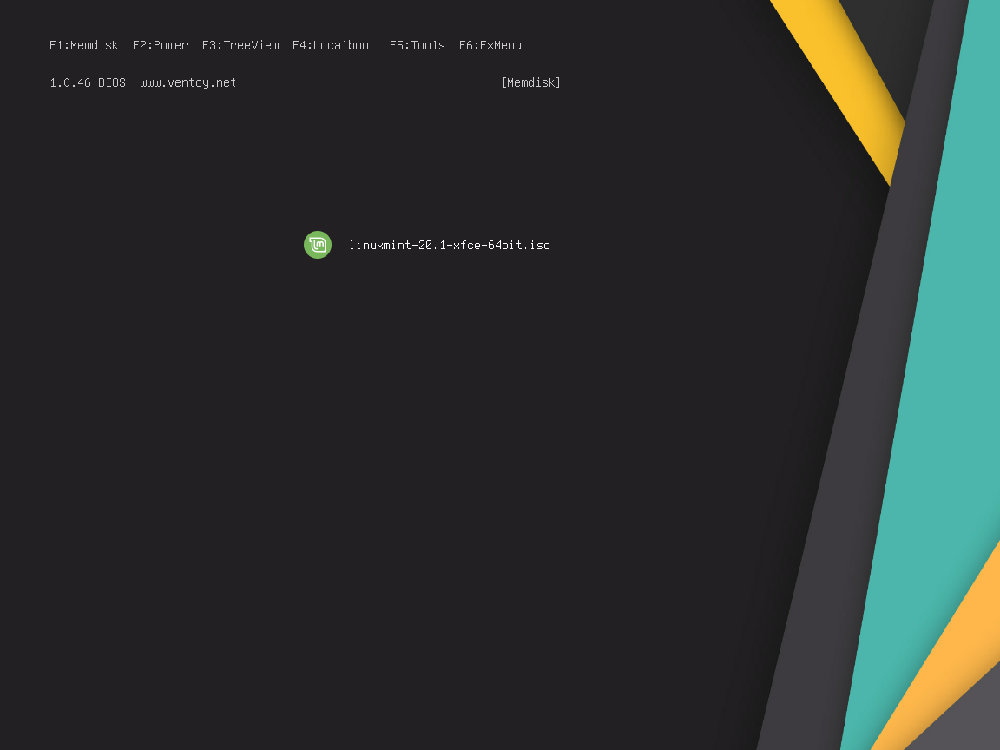
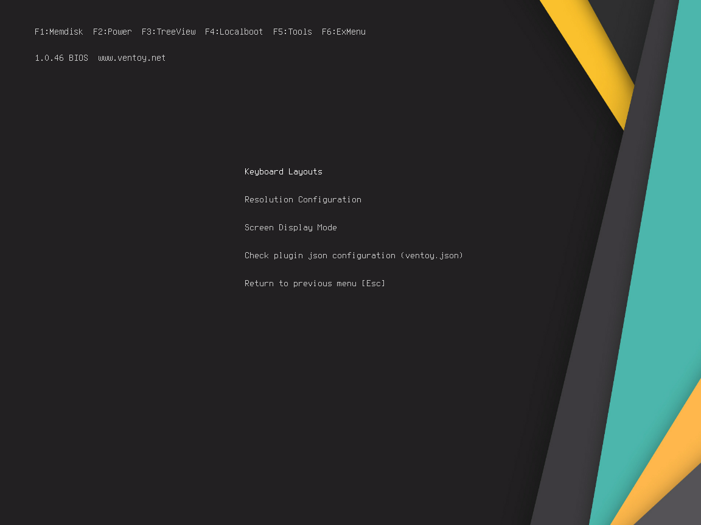

# ventoy-theme
My custom theme for ventoy\
[Ventoy](https://www.ventoy.net/en/index.html) and GRUB Theme by [vinceliuice](https://github.com/vinceliuice/grub2-themes).

**How to use?** : Just copy the `ventoy` folder and drop to your `/` flashdisk.

### Credits
Icons : https://github.com/AlgernonRepo/OperatingSystemIcons\
Codes : https://github.com/Teraskull/bigsur-grub2-theme\
Some Reference :\
- https://forums.ventoy.net/showthread.php?tid=1984
- https://stackoverflow.com/a/22106866
- https://www.ventoy.net/en/plugin_control.html
    
### Screenshot

Edit : Now with some configuration and **No Icons**

